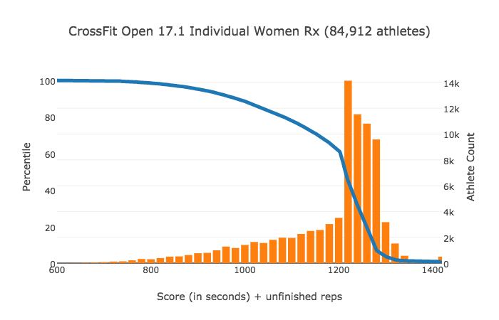

# CrossFit Games Open Statistics
[CrossFit Games Website](https://games.crossfit.com/) is an excellent resource to gauge one's performance against
an entire CrossFit community.  [Athlete individual pages](https://games.crossfit.com/athlete/703052) are especially useful
in determining the kinds of metrics required for a given level of performance.  What the CrossFit Games website lacks are
a rudimentary set of statistics, most notably the percentile -- as opposed to ordinal rank -- of an athletes' performance
for a given Open Workout.  Presented here, among other things, are said percentiles.

## CrossFit Open Percentiles
[This interactive website](https://2deviant.github.io/CrossFit/) contains the 2017 CrossFit Games Open workout statistics
available to date.  Example:

